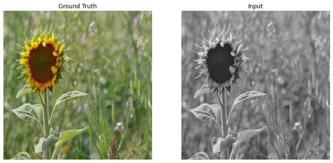
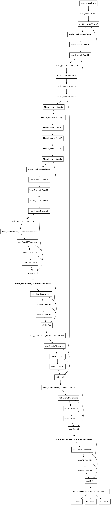
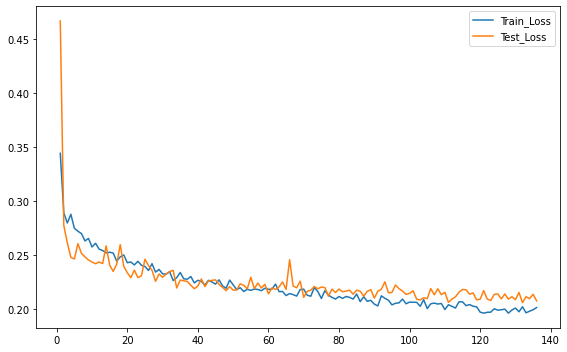
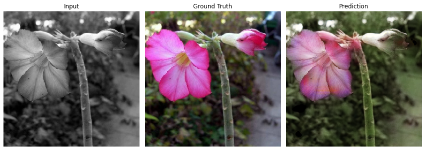
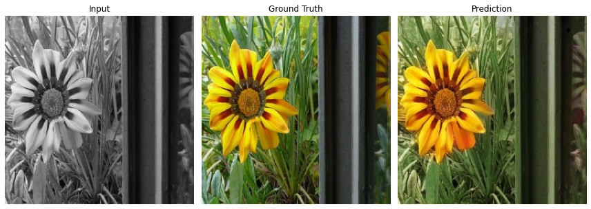
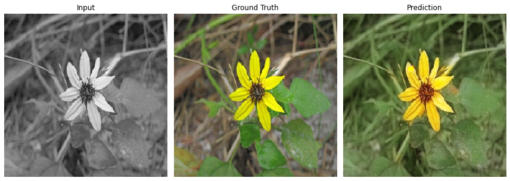
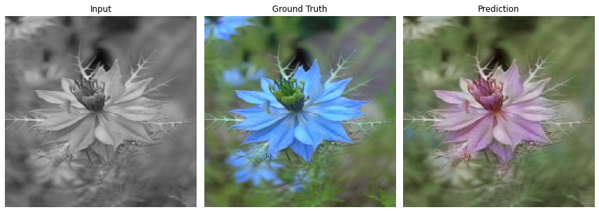

# Image Colorizer
*A deep-learning model that brings grayscale images to life.*

  
Turning black-and-white images into vibrant color using neural networks

---

## Overview

This project implements an **Image Colorization** model using deep learning. It takes **grayscale input images** and predicts their **colored versions**.  
The repository includes the model architecture, training pipeline, logs, and sample predictions.

---

## Sample Input → Output

  

---

## Model Architecture

  

---

## Training Logs

  

---

## Sample Predictions

  
  

  
  

  
  

---

## Features
- Colorizes grayscale images using a deep neural network  
- Includes training logs and model architecture diagrams  
- Easy to extend and experiment with  
- Ready for inference and testing  